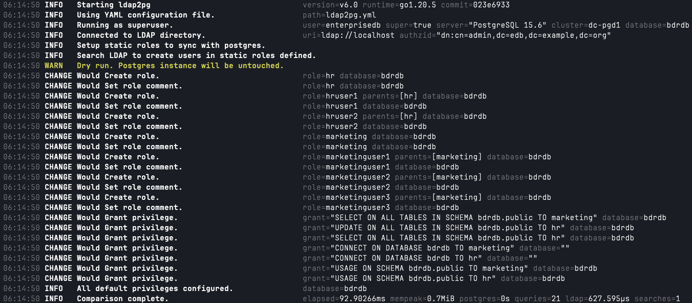
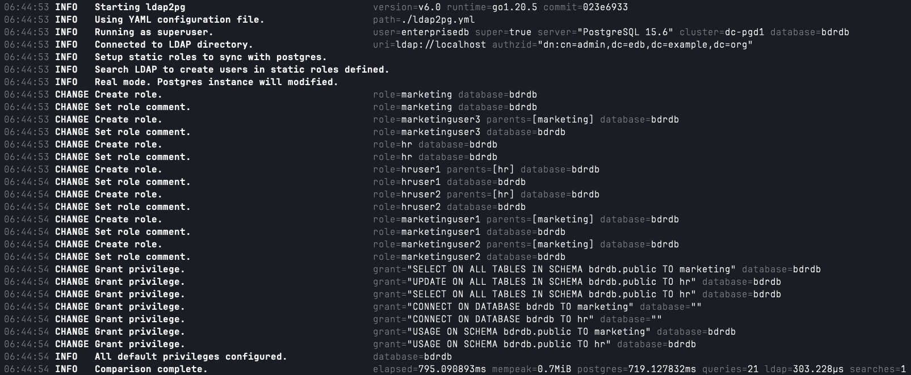

# Basic LDAP2PG Configuration using OpenLDAP

# Table of Contents
[Overview and Prerequisites](#overview-and-prerequisites)<br>
[Install and Configure OpenLDAP](#install-and-configure-open-ldap) <br>
[Create OpenLDAP Roles and Users](#create-openldap-roles-and-users)<br>
[Install and Configure ldap2pg](#install-and-configure-ldap2pg) <br>
[ldap2pg Demonstration](#ldap2pg-demonstration) <br>
[Remove Newly Created Roles and Users from PostgreSQL Database](#ldap2pg-demonstration) <br>
[Update YML to contain ALL schemas in a Database Except Public](#update-yml-file-to-include-all-schemas-except-for-public) 


## Overview and Prerequisites
The procedures detailed below will allow you to demonstrate the LDAP2PG synchronization between an OpenLDAP instance and a PostgreSQL instance.  

**Prerequisites**
- You will need to have a node available to install the OpenLDAP server.  
- You will need to have a node available to install the ldap2pg application.  
- You will need to have a node with a PostgreSQL database installed.
- Ensure that the node where the ldap2pg application is installed has access to both the OpenLDAP instance as well as the PostgreSQL databases for synchronization.
<br>

## Install and Configure Open LDAP 
1. Log onto the node you wish to run the OpenLDAP application.

2. Download and install [OpenLDAP](https://www.openldap.org/) as an administrator.

2. Use the following configurations for the sample OpenLDAP.  In this example the Administrator user used for the OpenLDAP instance is "admin" and the password is "admin".

		edb.example.org
		ou=edb
		cn=admin
		password = admin
	
3. Test the connection to OpenLDAP on the same server it was installed using the following command.  If ldapsearch does not exist, then install **openlap-clients** for Red Hat-based distributions or **ldap-utils** for Debian-based distributions.

		ldapsearch -H ldap://localhost -W -U admin -b "cn=admin,dc=edb,dc=example,dc=org"
		
## Create OpenLDAP Roles and Users
The following steps describe how to create the new sample roles and users within your OpenLDAP instance for this demonstration.

1. Copy all files from this repository folder to a folder on your OpenLDAP node:

		/ldap2pg/openldap-scripts
 
2. Execute the following command to add the organization "groups". (Enter the password for the OpenLDAP user you set up in this example it is "admin")

		ldapadd -x -D "cn=admin,dc=edb,dc=example,dc=org" -W -f ldap-scripts/create_ou.ldif

3. Execute the following command to add the groups "hr" and "marketing". (Enter the password for the OpenLDAP user you set up in this example it is "admin")

		ldapadd -x -D "cn=admin,dc=edb,dc=example,dc=org" -W -f ldap-scripts/create_groups.ldif

4. Execute the following command to create all the users. (Enter the password for the OpenLDAP user you set up in this example it is "admin")

		ldapadd -x -D "cn=admin,dc=edb,dc=example,dc=org" -W -f ldap-scripts/create_users.ldif

5. Execute the following command to add the users to the appropriate groups. (Enter the password for the OpenLDAP user you set up in this example it is "admin")

		ldapmodify -x -D "cn=admin,dc=edb,dc=example,dc=org" -W -f ldap-scripts/add_users_to_groups.ldif
		
6. Execute the following command to validate the OpenLDAP groups and users were successfully created.
	
		ldapsearch -x -LLL -b "ou=groups,dc=edb,dc=example,dc=org" "(|(cn=hr)(cn=marketing))"

2. This should yield the result:

		dn: cn=marketing,ou=groups,dc=edb,dc=example,dc=org
		objectClass: posixGroup
		cn: marketing
		gidNumber: 5001
		description: Marketing
		memberUid: uid=marketinguser1,ou=groups,dc=edb,dc=example,dc=org
		memberUid: uid=marketinguser2,ou=groups,dc=edb,dc=example,dc=org
		memberUid: uid=marketinguser3,ou=groups,dc=edb,dc=example,dc=org
		
		dn: cn=hr,ou=groups,dc=edb,dc=example,dc=org
		objectClass: posixGroup
		cn: hr
		gidNumber: 5000
		description: Human Resources
		memberUid: uid=hruser1,ou=groups,dc=edb,dc=example,dc=org
		memberUid: uid=hruser2,ou=groups,dc=edb,dc=example,dc=org
		
## Install and Configure ldap2pg
1.  Within your PostgreSQL instance, create a user as an unprivileged role with CREATEDB and CREATEROLE privileges.  As stated in the prerequisites ensure that this ldap2pg node has access to the PostgreSQL database to connect with this user.

2. Log onto the node you wish to run the ldap2pg application.

3. Download and install [ldap2pg](https://ldap2pg.readthedocs.io/en/latest/) as an administrator. 

4. **Configure PostgreSQL Connection Settings**  If only one PostgreSQL instance database will be synchronized you may set the following global environment variables for the PostgreSQL user. Replace the following variables to match your environment using the user created in step #1. Alternatively, in step #7 below, you may choose to include these settings in the synchronization scripts if multiple PostgreSQL instances and YAML files are needed.

		export PGUSER=ldap2pguser
		export PGPASSWORD='<password>'
		export PGDATABASE=postgres
		export PGPORT=5444
	
4. **Create LDAP Connection Config File** You may create the LDAP configuration file anywhere by setting the environment variable:  
-**export LDAPCONF=/path/to/your/ldap.conf**  <br>  
If you do not, when running ldap2pg, it will look for an LDAP configuration file for connection information in the following order:  
	
		path=/etc/ldap/ldap.conf
		path=/var/lib/edb-as/ldaprc 
		path=/var/lib/edb-as/.ldaprc 
		path=/var/lib/edb-as/ldap2pg/ldaprc  
		path=/path/to/your/ldap.conf 
		
5. **Configure LDAP Connection Config File** Configure the contents of the LDAP configuration file where the ldap2pg application will retrieve the connection information.  The key take away here is you MUST use the **PASSWORD** token to indicate the password for the LDAP authentication.
    
		BASE	  dc=edb,dc=example,dc=org
		URI	  ldap://ldap.enterprisedb.com
		BINDDN    cn=admin,dc=edb,dc=example,dc=org
		PASSWORD  admin

6. Copy all files from this project's repository folder to a folder on your ldap2pg node:

		/ldap2pg/ldap2pg-config
		
7. Update the environment variables in each of the SH scripts to match your environment or delete them if you are using the global settings defined in step #4.  An example of the contents of one of the SH scripts is the following:

		#!/bin/bash
		
		export PGUSER=ldap2pguser
		export PGPASSWORD='<password>'
		export PGDATABASE=postgres
		export PGPORT=5444
		
		ldap2pg --config ldap2pg.yml

8. **Configure the ldap2pg.yml File** The ldap2pg.yml defines the scope and search criterion for syncing the LDAP groups and users to the PostgreSQL databases.  The ldap2pg.yml may be used as is, except for the postgres mapping section.  
-List those roles you do not want to be synced separated by commas using the * as a wildcard.
-List the databases you want to include in the ldap search synchronization.
-List the schemas you want to include in the ldap search synchronization.

		postgres:
		  roles_blacklist_query: [admin,PostgreSQL, pg_*,bdr*,replication*,barman*,test*,aq*,streaming*,pgd*]
		  databases_query: [PostgreSQL]
		  schemas_query: [public]

9. Test the connection of ldap2pg by entering the following command.

		ldap2pg --config ldapp2pg/ldap2pg.yml

10. An example output that indicates a successful connection to the PostgreSQL database and the  OpenLDAP instance is the following:

		06:14:50 INFO   Starting ldap2pg                                 version=v6.0 runtime=go1.20.5 commit=023e6933
		06:14:50 INFO   Using YAML configuration file.                   path=ldap2pg.yml
		06:14:50 INFO   Running as superuser.                            user=ldap2pguser super=false server="PostgreSQL 15.6" cluster=dc-pgd1 database=postgres
		06:14:50 INFO   Connected to LDAP directory.                     uri=ldap://example.com authzid="dn:cn=admin,dc=edb,dc=example,dc=org"

## ldap2pg Demonstration
The following sub-sections describe the steps to synchronize roles and users between OpenLDAP and a PostgreSQL database.


### View Groups and Users in LDAP
1.  From the OpenLDAP node list the users that exist in the hr and marketing groups previously created by executing the command:
	
		ldapsearch -x -LLL -b "ou=groups,dc=edb,dc=example,dc=org" "(|(cn=hr)(cn=marketing))"

2. This should yield the result:

		dn: cn=marketing,ou=groups,dc=edb,dc=example,dc=org
		objectClass: posixGroup
		cn: marketing
		gidNumber: 5001
		description: Marketing
		memberUid: uid=marketinguser1,ou=groups,dc=edb,dc=example,dc=org
		memberUid: uid=marketinguser2,ou=groups,dc=edb,dc=example,dc=org
		memberUid: uid=marketinguser3,ou=groups,dc=edb,dc=example,dc=org
		
		dn: cn=hr,ou=groups,dc=edb,dc=example,dc=org
		objectClass: posixGroup
		cn: hr
		gidNumber: 5000
		description: Human Resources
		memberUid: uid=hruser1,ou=groups,dc=edb,dc=example,dc=org
		memberUid: uid=hruser2,ou=groups,dc=edb,dc=example,dc=org

### View Current Roles and Users in PostgreSQL Database
1. Obtain a database session to the PostgreSQL database you are synchronizing with.  
	
2. Execute the following command to show the current roles, making note that the OpenLDAP users and groups do not yet exist.
	
		\du
	
2. Execute the following command to show the members that exist for each role within the database.  Again, noting that these LDAP users and groups do not yet exist.
	
		SELECT r.rolname AS role_name,  u.rolname AS member_username
		FROM pg_roles r
		JOIN pg_auth_members m ON r.oid = m.roleid
		JOIN pg_roles u ON m.member = u.oid;
	
3. Execute the following command to show the privileges on a table that will be included in the synchronization.  Again, noticing that new roles and users do not have any privileges.  
	
		\dp <table name>
	
### Run the Validation and Synchronization
	
1. **Validate Synchronization**  Execute the following script to validate the synchronization of the roles and users.  The output should indicate the creation of the hr, marketing roles and all the new users.  
	
		./ldap2pg/configldap.sh
		

		
	
2. **Execute Synchronization** Now that the synchronization results have been reviewed and validated, execute the following command to synchronize the roles and users. 
	
		./ldap2pg/syncldap.sh
		

	
###  View Newly Created Roles and Users in PostgreSQL Database
1. Obtain a database session to the PostgreSQL database you are synchronizing with. 
	
2. Execute the following commands to list the roles and users within the database.  

		\du
		
		SELECT r.rolname AS role_name,  u.rolname AS member_username
		FROM pg_roles r
		JOIN pg_auth_members m ON r.oid = m.roleid
		JOIN pg_roles u ON m.member = u.oid;
		
3. Review the results that should now show new hr and marketing roles as well as the users within it were created in the PostgreSQL database.

		      role_name       |  member_username
		----------------------+--------------------
		 marketing            | marketinguser2
		 marketing            | marketinguser1
		 marketing            | marketinguser3
		 hr                   | hruser2
		 hr                   | hruser1
	
4. Execute the following command to describe the privileges on a table that was synchronized by ldap2pg.  
	
		\dp <table name>
		
5. Review the results that should now show that the marketing role has READ permission and the hr role has READ-WRITE permission which is what was indicated in the ldap2pg.yml file. The following is an example of a table named employees that was synchronized.

		bdrdb=# \dp employees
		                                       Access privileges
		 Schema |   Name    | Type  |         Access privileges         | Column privileges | Policies
		--------+-----------+-------+-----------------------------------+-------------------+----------
		 public | employees | table | enterprisedb=arwdDxt/enterprisedb+|                   |
		        |           |       | marketing=r/enterprisedb         +|                   |
		        |           |       | hr=rw/enterprisedb                |                   |
		(1 row)
	


## Remove Newly Created Roles and Users from PostgreSQL Database 
This section describes how to "clean-up" your database to run this procedure again if needed.

1. Copy the file from this project's repository folder to a folder on your PostgreSQL node:

		/ldap2pg/psql-scripts/revoke-priv-roles.sql

2. Obtain a database session to the PostgreSQL database you are synchronizing with. 
	
3. Execute the following command to remove the newly created marketing and hr roles and their users from the PostgreSQL database.

		\i  psql-scripts/revoke-priv-roles.sql


## Update YML File to Include ALL schemas except for public 
This section describes how to update an existing yml file to explicitly indicate all schemas within a database excluding the public schema. 

1.  The wrapper/wrapper.sh takes 2 parameters.
	- **Original ldap2pg.yml File** - Path to original ldap2pg.yml file. 
	- **Database Name** - Name of database to get all schemas, except public 

2.  The resulting yml file is created in the same directory as the wrapper.sh as new_ldap2pg.yml 
   
3.  You can find an example of a before and after yml files as a result of running the script:
   	- [wrapper/ldap2pg.yml](wrapper/ldap2pg.yml)
   	- [wrapper/new_ldap2pg.yml](wrapper/new_ldap2pg.yml)
     
4.  An example usage for calling the wrapper.sh:

	``` /wrapper.sh ldap2pg.yml bdrdb```


